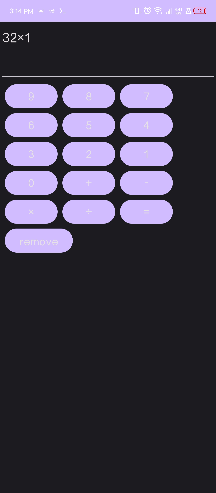

# Simple Calculator
A minimalist Android calculator app built using Java and ViewBinding. Designed for simplicity and quick math operations.
This was created because of boredom lol.
## Features

- Basic arithmetic: `+`, `-`, `×`, `÷`
- Clean and responsive UI
- Instant results
- Backspace / clear functionality
- Written fully in Java with ViewBinding

## Screenshots




## Getting Started

To run the project locally:

1. Clone the repo:

   ```bash
   git clone https://github.com/Nemirus/Simple-Calculator.git
   ```

2. Open the project in **Android IDE**
3. Build & Run on an emulator or physical device

## Project Structure

```
Simple-Calculator/
├── app/
│   └── src/
│       └── main/
│           ├── java/com/nemirus/calculator/
│           │   └── MainActivity.java
│           └── res/layout/
│               └── activity_main.xml
├── build.gradle
└── README.md
```

## Contributions

Pull requests are welcome. For major changes, open an issue first to discuss what you’d like to change.

## License

This project is licensed under the MIT License.
